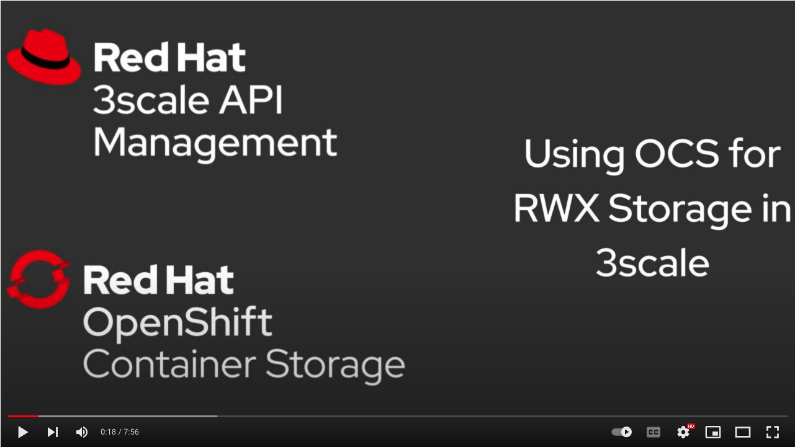
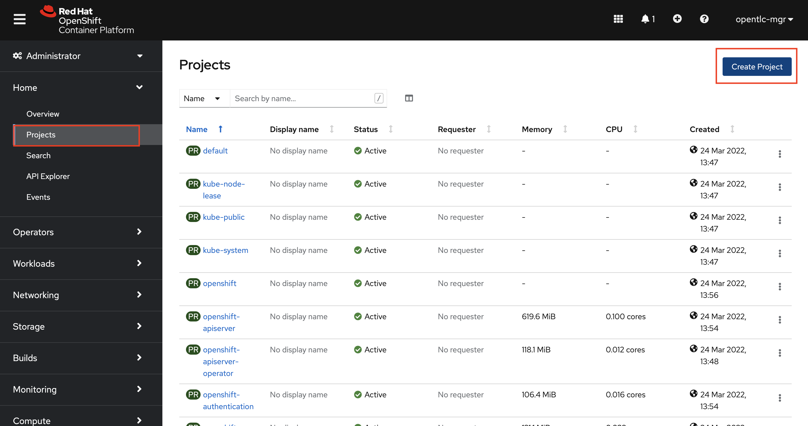
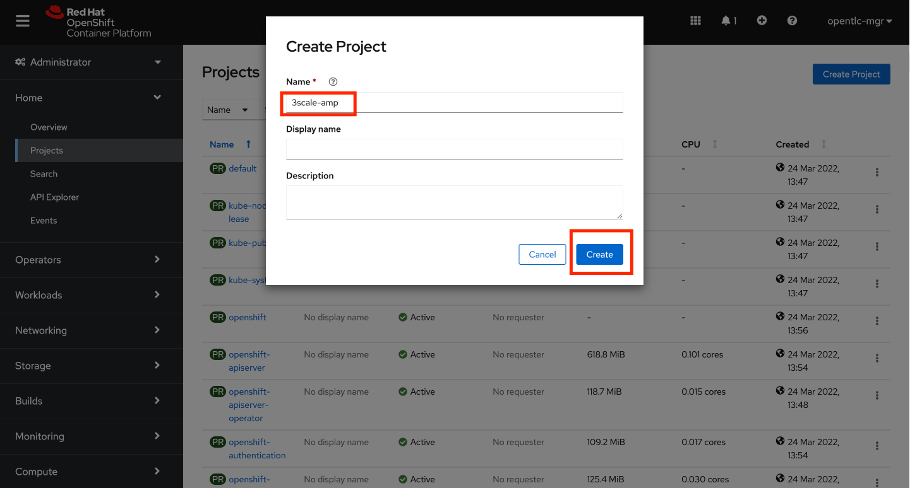
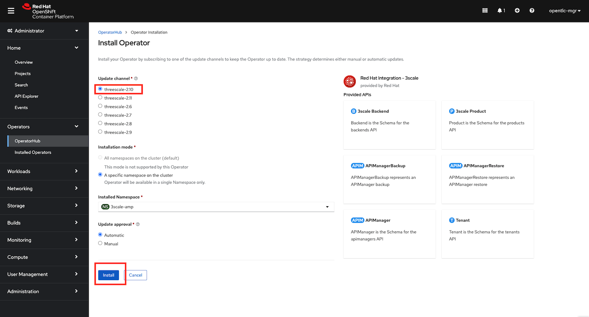
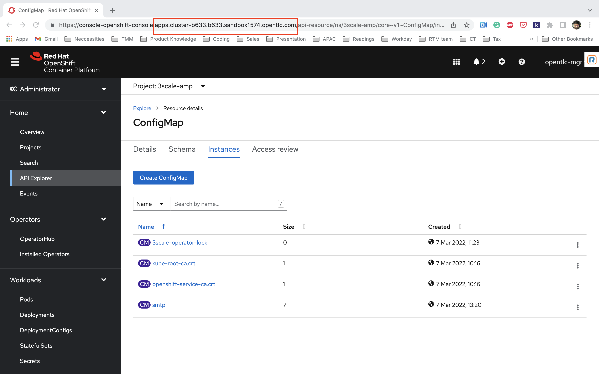

//attributes
:title: Installing 3scale on OpenShift using OpenShift Container Storage 

[id='3scale-security-demo'] 
= {title}

//Description text for Solution Pattern
Developers portals have become a very important starting point for businesses that want to share their APIs both internally and externally. Red Hat 3scale API management platform provides a highly customizable developer portal that organizations can leverage as a part of their API program. 3scale users can customize the look and feel of the entire Developer Portal to match their own use cases and branding. They have complete control over every element of the portal in order to make it as easy as possible for developers to understand how to use their API. A successful API Developer Portal will help your developers turn concepts into working apps in no time at all.

3scale admins can customize the developer portal using HTML, CSS, JS, etc,. 3scale’s System File storage stores these Static files (HTML, CSS, JS, etc) uploaded to the System by its CMS feature, for the purpose of creating a Developer Portal. The System component of 3scales needs an RWX(ReadWriteMany) Persistent Volume for CMS and system app assets. An RWX Persistent Volume enables multiple nodes to simultaneously read and write to the storage volume. With an RWX access mode the system can be scaled horizontally with multiple pods uploading and reading said static files, which increases the scalability of the API manager and developer portal if needed. 

This blog post explores the installation of 3scale on OpenShift 4.x using Cephfs (part of Red Hat OpenShift Container Storage) for RWX storage. We will be using the 3scale Operator and OpenShift Container Storage Operator in this excercise. 

## Red Hat Integration 3scale Operator Overview
The 3scale Operator creates and maintains the Red Hat 3scale API Management on OpenShift in various deployment configurations. The Operator also has configurable setting that'll make sure make sure you receive automatic updates of micro releases of the product. The Operator provides the following functionality:

* A way to install a 3scale API Management solution, providing configurability options at the time of installation
* Upgrade from previously installed 3scale API Management solution
* Reconcilliation Tunable CRD parameters after 3scale API Management solution is installed
* Ability to define 3scale API definitions and set them into a 3scale API Management solution


## OpenShift Container Storage Operator Overview
Red Hat OpenShift Container Storage deploys three operators.

* OpenShift Container Storage operator
The OpenShift Container Storage operator is the primary operator for OpenShift Container Storage. The ocs-operator is one of the three main operators of OpenShift Container Storage and can be described as a "meta" operator. It is an operator meant to influence other operators and serves as a configuration gateway for the features provided by the other operators. It does not directly manage the other operators.It serves to facilitate the other operators in OpenShift Container Storage by performing administrative tasks outside their scope as well as watching and configuring their CustomResources. 

* Rook
Rook deploys and manages Ceph on OpenShift, which provides block and file storage. *_We will be using the Cephfs storage class as a part of this excercise._* 

* NooBaa operator
The NooBaa operator deploys and manages the NooBaa Multi-Cloud Gateway on OpenShift, which provides object storage.

*Credentials:* +

OpenShift Username: Use your OPENTLC credentials to log into the OpenShift console + 

OpenShift Password: Use your OPENTLC credentials to log into the OpenShift console

IMPORTANT: *READ THIS BEFORE PROCEEDING*. This demo only focusses on the RWX storage aspect of Red Hat 3scale installation and by no means a complete end to end installation of Red Hat 3Scale API Management.

## Installation Overview
. Request Openshift (from RHPDS) 
. Create a project to install 3scale
. Install 3scale operator
. Install OpenShift Container Storage operator
. Create ClusterStorage resource
. Create APIManager resource

### Here's the video version for folks who prefer the format. (Though I would highly recommend going through the complete guide):



*Credentials:* 

OpenShift Username: Use your OPENTLC credentials to log into the OpenShift console + 

OpenShift Password: Use your OPENTLC credentials to log into the OpenShift console

'''

### 1. Request Openshift from RHPDS
. Order `OpenShift Workshop 4.8` on the [RHPDS catalog](https://rhpds.redhat.com/catalog/explorer).
+
image::images/rhpds-order.png[rhpds-order]

. Confirm the warning, and leave all other default settings.
. Select `Training` as the Purpose.
. Submit - this can take about 30 minutes to finish, and you will get an email. 
. If the provision fails, simply repeat the previous steps.


### 2. Create a 3scale project

. Navigate to Projects on the Console UI and Click on Create Project 
+


. Create `3scale-amp` project.
+



### 3. Install 3scale Operator
. From the OpenShift Admin Console, navigate to Operators > OperatorHub > Type 3scale in the search box and click on the Red hat Integration - 3scale Operator and Install.  Make sure you are in the 3scale-amp project while you do this and following operations
+
image:images/3scale-oh.png[OperatorHub-3scale]
+
image:images/3scale-operator-install-1.png[Operator-Install-1]

. Choose 'threescale-2.10' and leave the rest of the values as default. Complete the operator installation 
+


. After the installation is complete. Navigate to Operators > Installed Operators to verify the same
+
image:images/installed-op.png[3scale-operator-install-verified]

 
### 4. Install the OpenShift Container Storage Operator
. From the OpenShift Admin Console, navigate to Operators > OperatorHub > Type 'OpenShift Container Storage' in the search box and click on the OpenShift Container Storage Operator and Install.
+
image:images/ocs-oh.png[OperatorHub-OCS]
+
image:images/ocs-operator-install-1.png[OCS-Operator-Install-1]

. Select update channel `stable-4.8` and install. The operator installation might take few minutes wai until the Create Storage Cluster button is activated. 
+
image:images/ocs-operator-install-2.png[OCS-Operator-Install-2]
+
[NOTE]
====
OpenShift Container Storage Operator will create the 'openshift-storage' namespace/project by default. This demo uses the default namespace. Users can choose any other namespace based on their scenario. 
====

. After installing the operator, you should see this message prompting you to create a `StorageCluster`. Click on the Create Storage Cluster Button
+
image:images/ocs-create-cluster.png[OCS-Create-Cluster]

. Set `Requested Capacity` to `0.5 TiB`
. Select all three nodes. All other settings can keep their defaults. Hit Create. If you see a `404` message, reload your browser.
+
image:images/requested-cap.png[OCS-Requested-Capacity]
+
image:images/requested-cap-2.png[OCS-Requested-Capacity-2]
+
image:images/requested-cap-3.png[OCS-Requested-Capacity-3]

### 5. Create APIManager Resource
Deploying the APIManager custom resource will make the operator begin processing and will deploy a 3scale solution from it

. Make sure you are in the 3scale-amp project

. Now create the API manager by using the Console UI. Select the 3scale-amp project. From the 3scale-amp project navigate to Operators > Installed Operators > Red Hat Integration - 3scale Red Hat Integration - 3scale > Click on the API Manager tab > Create APIManager > YAML view >. Remove the the existing yaml and copy paste the code provided in step 3 as shown below
+
image:images/console-apimanager.gif[api-manager]


. YAML code for API Manager:
    
    apiVersion: apps.3scale.net/v1alpha1
    kind: APIManager
    metadata:
      name: apimanager
    spec:
      system:
        fileStorage:
          persistentVolumeClaim:
            storageClassName: ocs-storagecluster-cephfs
        redisResources:
          limits:
            memory: 6Gi
      backend:
        redisResources:
          limits:
            memory: 6Gi
      wildcardDomain: <WILDCARD-DOMAIN>


You can find the wildcard dns of your OpenShift cluster from the Console URL. Be sure to remove the placeholder marks for your parameters: `< >`. 


The `wildcardDomain` parameter can be any desired name you wish to give that resolves to the IP addresses
of OpenShift router nodes.

When 3scale has been installed, a default *tenant* is created for you ready to be used,
with a fixed URL: `3scale-admin.${wildcardDomain}`.
For instance, when the *<wildCardDomain>* is `example.com`, then the Admin Portal URL would be:

```
https://3scale-admin.example.com
```

Optionally, you can create new tenants on the _MASTER portal URL_, with a fixed URL:

```
https://master.example.com
```


### 6. Verify the Installation

. Wait for 10 mins for all the 3scale pods to be ready. You can check the progress and see them all coming up by navigating to Developer > Topology
+
image:images/topology.png[topology]

. Once all the pods are Up (have a dark blue circle around them). Click on the system-app to get the URLs of the master tenant and admin-tenant of 3scale. 
+
image:images/admin-tenant-route.gif[admin-tenant]

. All required access credentials are stored in `system-seed` secret. Navigate to Secrets > 'Search for 'system-seed' anc lick on it > Navigate to the bottom of the details page to find the admin_user and admin_password used to login to 3scale 
+
image:images/system-seed.png[system-seed]
+
image:images/cred.png[admin-cred]

. Login to the `3scale-admin` tenant and verify that you can open the Developer Portal and the Content is loaded correctly.
+
image:images/dev-portal.gif[dev-portal]


## THE END
