//attributes
:title: Installing 3Scale on OpenShift using Nooba for PV

[id='3Scale-security-demo'] 
= {title}

//Description text for Solution Pattern
Developers portals have become a very important starting point for businesses that want to share their APIs both internally and externally. Red Hat 3Scale API management platform provides a highly customizable developer portal that organizations can leverage as a part of their API program. 3Scale admins can customize the developer portal using HTML, CSS, JS, etc, and make it own aligned to their own API audiences. 3Scale’s System File storage stores these Static files (HTML, CSS, JS, etc) uploaded to the System by its CMS feature, for the purpose of creating a Developer Portal. The System component of 3Scales needs an RWX(ReadWriteMany) Persistent Volume for CMS and system app assets. An RWX Persistent Volume enables multiple nodes to simultaneously read and write to the storage volume. With an RWX access mode the system can be scaled horizontally with multiple pods uploading and reading said static files, which increases the scalability of the API manager and developer portal if needed. 

This blog post explores the installation of 3Scale on OpenShift 4.x using Nooba (part of Red Hat OpenShift Container Storage) for RWX storage.


*Credentials:* +

OpenShift Username: Use your OPENTLC credentials to log into the OpenShift console + 

OpenShift Password: Use your OPENTLC credentials to log into the OpenShift console

# Installation Overview
. Request RHPDS + create project
. In web console, update machinesets to change 3rd set from 0 to 1 replica
. Install 3scale operator
. Install OpenShift Container Storage operator
. Create ClusterStorage resource using all 3 machines
. Create APIManager resource

'''

### 1. Request Openshift from RHPDS
. Order `OpenShift Workshop 4.8` on the [RHPDS catalog](https://rhpds.redhat.com/catalog/explorer).
+
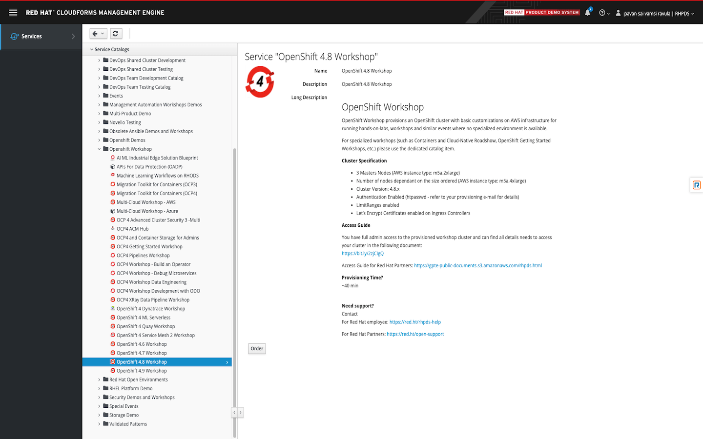

. Confirm the warning, and leave all other default settings.
. Select `Training` as the Purpose.
. Submit - this can take about 30 minutes to finish, and you will get an email. 
. If the provision fails, simply repeat the previous steps.


### 2. Create a 3Scale project
. Once provisioned, you can use `ssh` to the bastion using the SSH password provided in the email to create a new project.
+
[NOTE]
====
You can also use the OpenShift Console UI to create a project
====

. sudo as `root` user:

    # sudo -i
    
. Create `3scale-amp` project.
    
    # oc new-project 3scale-amp
+
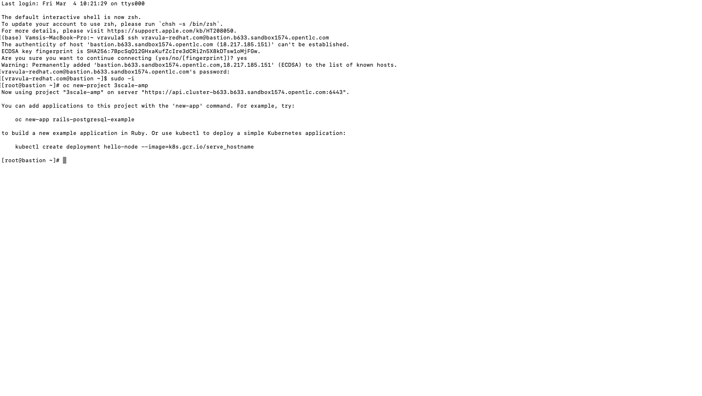

### 3. Update machinesets
. In the web UI, navigate to `Compute` > `MachineSets`
. You should see 3 MachineSets, with one spinned down. Update the machine count of that MachineSet to 1.
+
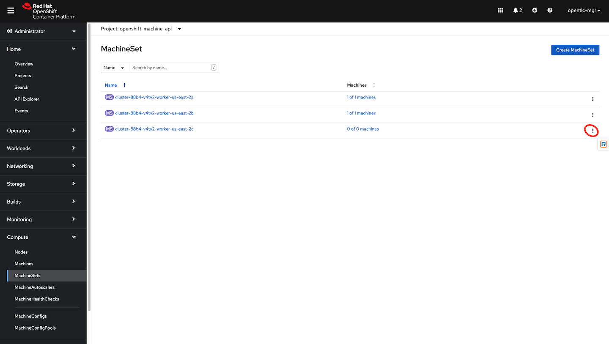
+
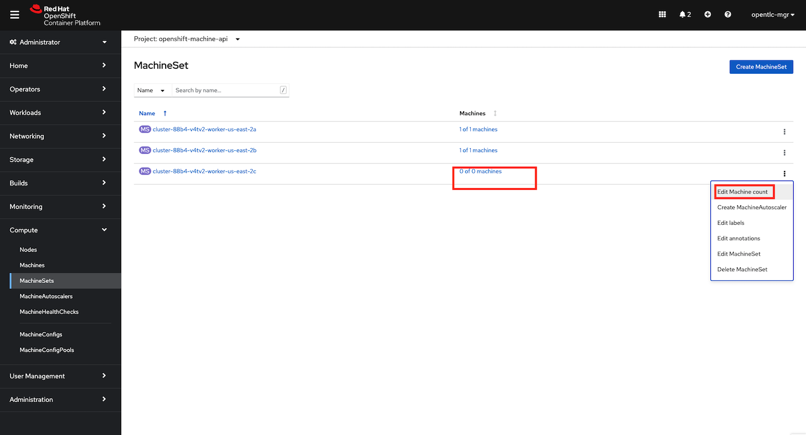
+
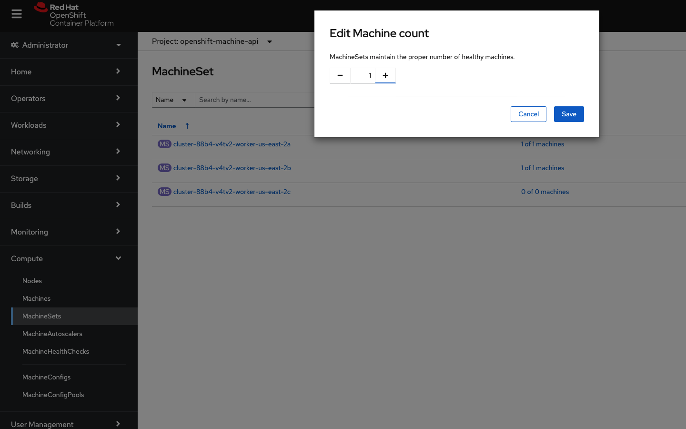
+


### 3. Install 3Scale Operator
. From the OpenShift Admin Console, navigate to Operators > OperatorHub > Type 3Scale in the search box and click on the Red hat Integration - 3Scale Operator and Install.  Make sure you are in the 3Scale-amp project while you do this and following operations
+
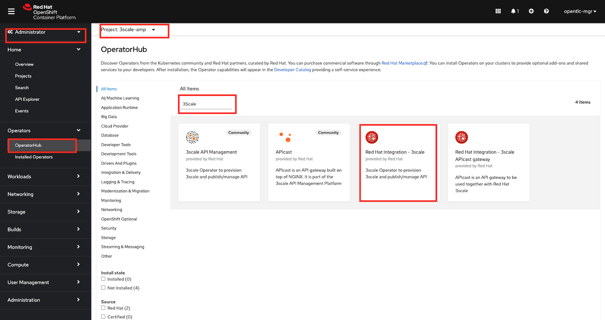
+
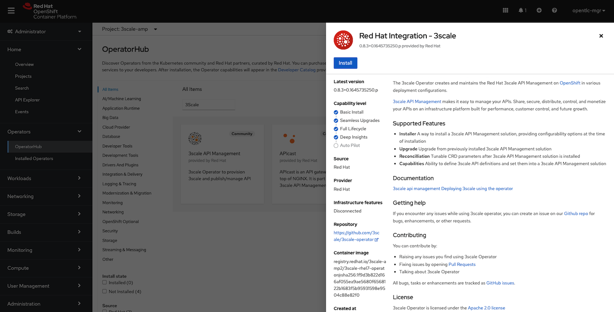

. Choose 'threescale-2.10' and leave the rest of the values as default. Complete the operator installation 
+


. After the installation is complete. Navigate to Operators > Installed Operators to verify the same
+
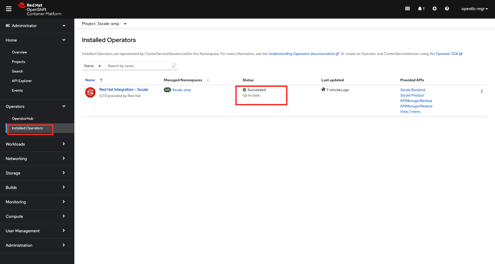

 
### 4. Install the OpenShift Container Storage Operator
. From the OpenShift Admin Console, navigate to Operators > OperatorHub > Type 'OpenShift Container Storage' in the search box and click on the OpenShift Container Storage Operator and Install.
+
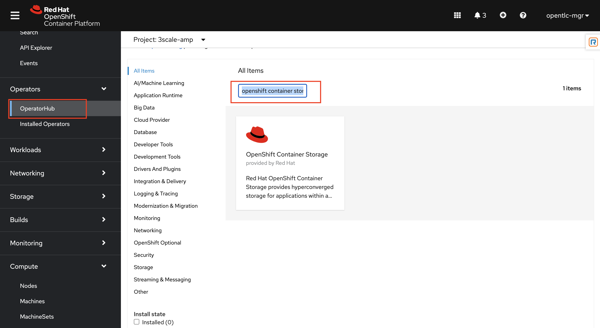
+
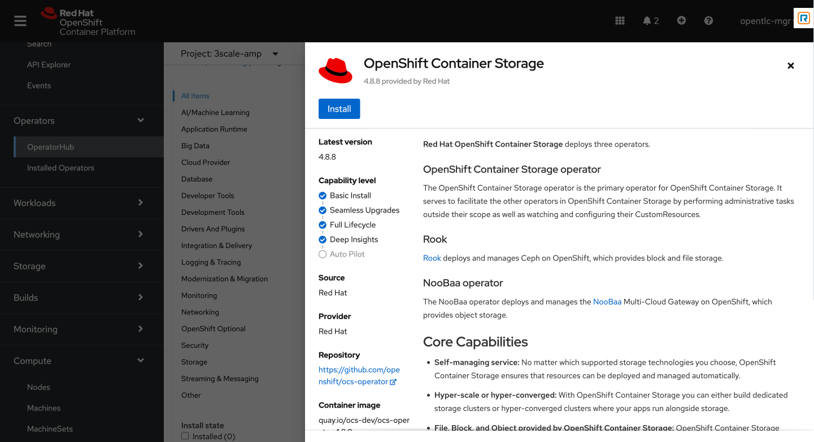

. Select update channel `stable-4.8` and install. The operator installation might take few minutes wai until the Create Storage Cluster button is activated. 
+
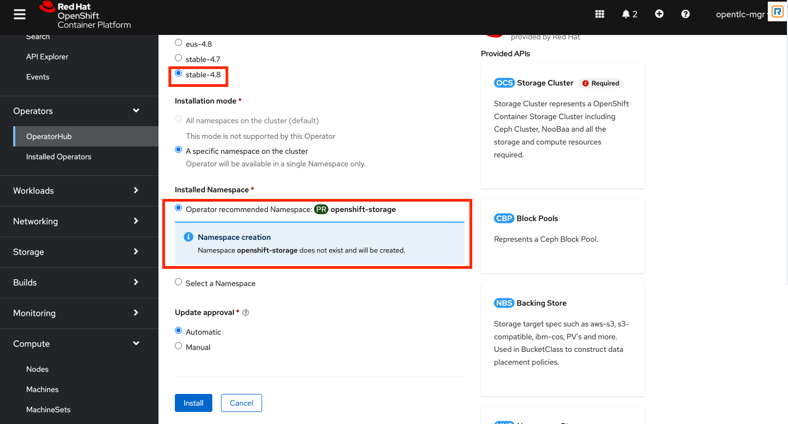
+
[NOTE]
====
OpenShift Container Storage Operator will create the 'openshift-storage' namespace/project by default. This demo uses the default namespace. Users can choose any other namespace based on their scenario. 
====

. After installing the operator, you should see this message prompting you to create a `StorageCluster`. Click on the Create Storage Cluster Button
+
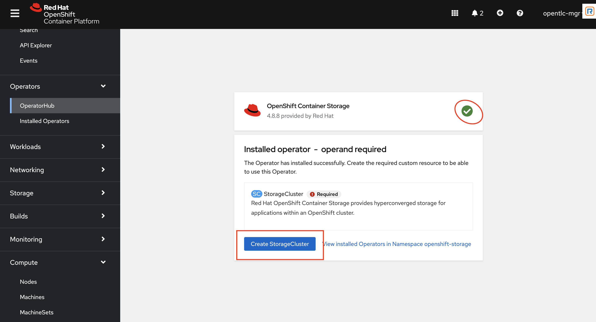

. Set `Requested Capacity` to `0.5 TiB`
. Select all three nodes. All other settings can keep their defaults. Hit Create. If you see a `404` message, reload your browser.
+
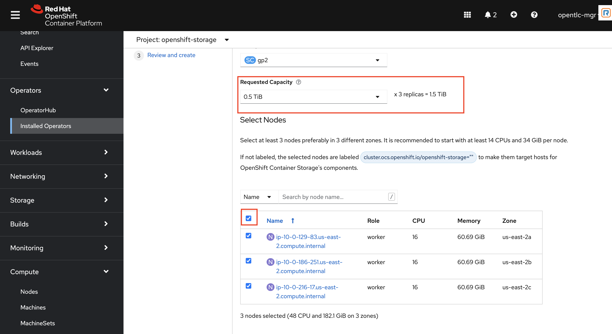
+
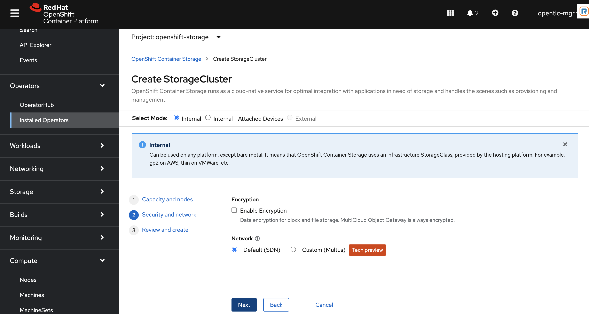
+
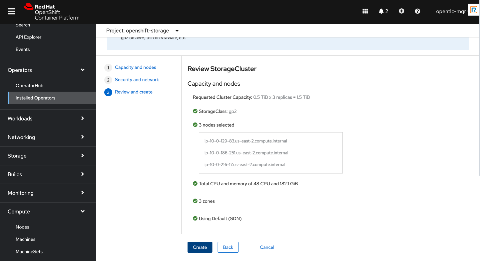

### 5. Create APIManager Resource

. Open the terminal and check if you are in the 3Scale-amp project:

    # oc project
    
. Create the `smtp.yml` configmap to configure SMTP access:

    # vim smtp.yml
    
    kind: ConfigMap
    apiVersion: v1
    metadata:
      name: smtp
      labels:
        app: 3scale-api-management
        threescale_component: system
        threescale_component_element: smtp
    data:
      address: 'smtp.gmail.com'
      authentication: 'login'
      domain: 'redhat.com'
      openssl.verify.mode: 'false'
      password: '<< your password>>'
      port: '587'
      username: '<< your userid>>'
  
. Add the configmap to `3scale-amp` namespace:

    # oc create -f smtp.yml
    
+
[NOTE]
====
Alternatively, You can also create this configmap by using the Console UI. Select the 3scale-amp project. From the 3Scale-amp project navigate to Home > API Explorer > ConfigMap > Instances > Create ConfigMap. Remove the the existing yaml and copy paste the one shown above
image:images/console-configmap.gif[config-map]
====

. Add the APIManager using the terminal:

    # vim amp-s3.yml
    
    apiVersion: apps.3scale.net/v1alpha1
    kind: APIManager
    metadata:
      name: apimanager
    spec:
      system:
        fileStorage:
          persistentVolumeClaim:
            storageClassName: ocs-storagecluster-cephfs
        redisResources:
          limits:
            memory: 6Gi
      backend:
        redisResources:
          limits:
            memory: 6Gi
      wildcardDomain: <WILDCARD-DOMAIN>


In our case replace the <WILDCARD-DOMAIN> with OpenShift route i.e apps.cluster-b633.b633.sandbox1574.opentlc.com when using RHPDS. Be sure to remove the placeholder marks for your parameters: `< >`. You can find the wildcard dns of your OpenShift cluster by typing in this command on the terminal window:

    oc get ingresscontroller default -n openshift-ingress-operator -o json | jq -r '.status.domain'

The `wildcardDomain` parameter can be any desired name you wish to give that resolves to the IP addresses
of OpenShift router nodes.

When 3scale has been installed, a default *tenant* is created for you ready to be used,
with a fixed URL: `3scale-admin.${wildcardDomain}`.
For instance, when the *<wildCardDomain>* is `example.com`, then the Admin Portal URL would be:

```
https://3scale-admin.example.com
```

Optionally, you can create new tenants on the _MASTER portal URL_, with a fixed URL:

```
https://master.example.com
```


[NOTE]
====
Alternatively, You can also create this API manager by using the Console UI. Select the 3scale-amp project. From the 3Scale-amp project navigate to Operators > Installed Operators > Red Hat Integration - 3scale
Red Hat Integration - 3scale > Click on the API Manager tab > Create APIManager > YAML view >. Remove the the existing yaml and copy paste the one shown above
image:images/console-apimanager.gif[api-manager]
====


### 6. Verify the Installation

. Wait for 10 mins for all the 3Scale pods to be ready. You can check the progress and see them all coming up by navigating to Developer > Topology
+
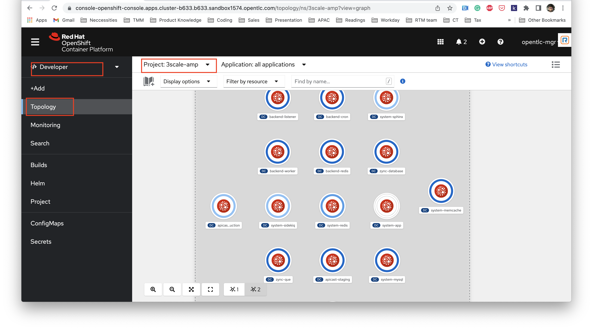

. Once all the pods are Up (have a dark blue circle around them). Click on the system-app to get the URLs of the master tenant and admin-tenant of 3Scale. 
+
image:images/admin-tenant-route.gif[admin-tenant]

. All required access credentials are stored in `system-seed` secret. Navigate to Secrets > 'Search for 'system-seed' anc lick on it > Navigate to the bottom of the details page to find the admin_user and admin_password used to login to 3Scale 
+
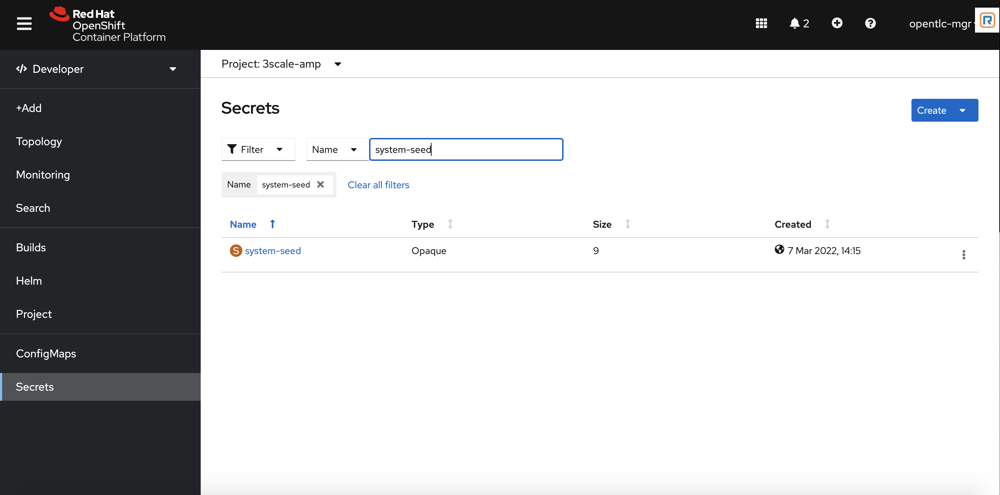
+
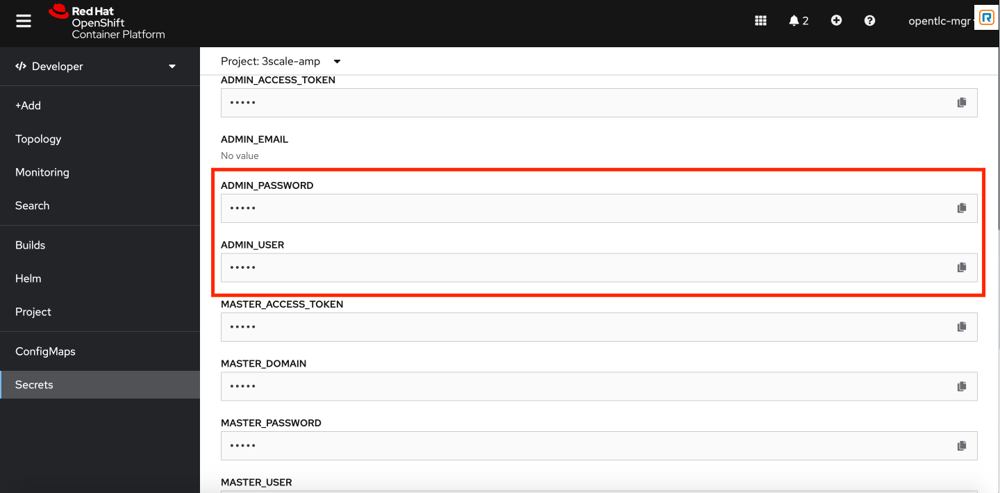

. Login to the `3scale-admin` tenant and verify that you can open the Developer Portal and the Content is loaded correctly.
+
image:images/dev-portal.gif[dev-portal]


Write about API Manager a little bit
Make changes to the intro
